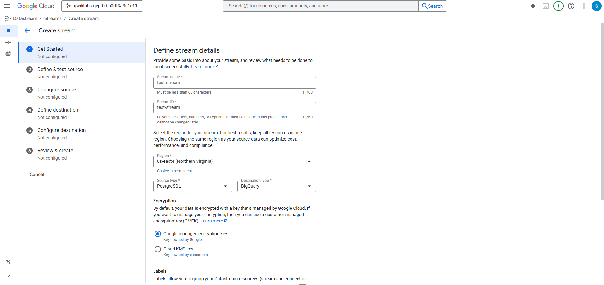
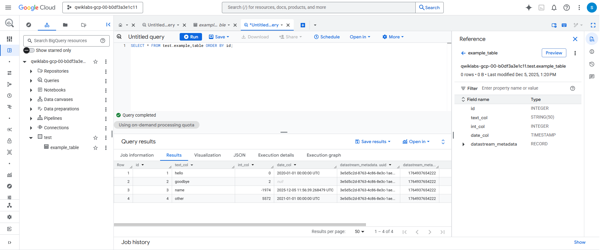
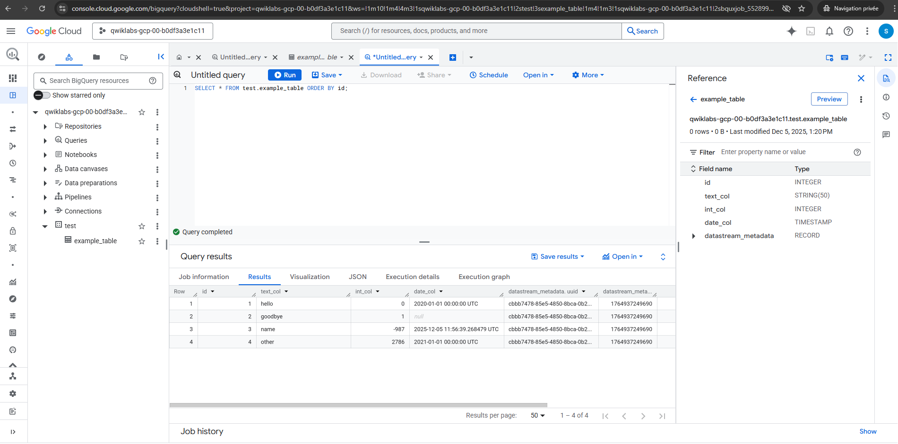

<h1> Datastream: PostgreSQL → BigQuery Real-Time Replication (CDC)</h1>

This project demonstrates how to build a <strong>real-time Change Data Capture (CDC)</strong> pipeline on Google Cloud using:

<ul>
  <li><strong>Cloud SQL for PostgreSQL</strong> (source database)</li>
  <li><strong>Datastream</strong> (CDC + replication service)</li>
  <li><strong>BigQuery</strong> (analytics destination)</li>
</ul>

The pipeline streams both <strong>initial database content</strong> and <strong>ongoing changes</strong> (INSERT, UPDATE, DELETE) 
from PostgreSQL into BigQuery with low latency.

<h2> Architecture Overview</h2>

<pre>
Cloud SQL PostgreSQL (logical decoding enabled)
               │
               ▼
          Datastream
(CDC: reads WAL logs, replication slot)
               │
               ▼
         BigQuery Dataset
      (tables auto-created)
</pre>

<h2> Objectives</h2>

<ul>
  <li>Deploy a PostgreSQL instance on Cloud SQL</li>
  <li>Enable logical decoding for CDC</li>
  <li>Create tables, schemas, and sample data</li>
  <li>Configure Datastream connection profiles</li>
  <li>Create a real-time replication stream to BigQuery</li>
  <li>Validate initial backfill and ongoing CDC updates</li>
</ul>

<h2> Task 1 — Create and Populate PostgreSQL in Cloud SQL</h2>

<h3> Enable Cloud SQL API</h3>
<pre><code>gcloud services enable sqladmin.googleapis.com
</code></pre>

<h3> Create the PostgreSQL instance</h3>
<pre><code>POSTGRES_INSTANCE=postgres-db
DATASTREAM_IPS=34.74.216.163,34.75.166.194,104.196.6.24,34.73.50.6,35.237.45.20

gcloud sql instances create ${POSTGRES_INSTANCE} \
    --database-version=POSTGRES_14 \
    --cpu=2 --memory=10GB \
    --authorized-networks=${DATASTREAM_IPS} \
    --region=us-east1 \
    --root-password pwd \
    --database-flags=cloudsql.logical_decoding=on
</code></pre>

<h3> Connect to PostgreSQL</h3>
<pre><code>gcloud sql connect postgres-db --user=postgres
</code></pre>

<h3> Create schema, table, and insert sample data</h3>

<pre><code>CREATE SCHEMA IF NOT EXISTS test;

CREATE TABLE IF NOT EXISTS test.example_table (
  id SERIAL PRIMARY KEY,
  text_col VARCHAR(50),
  int_col INT,
  date_col TIMESTAMP
);

ALTER TABLE test.example_table REPLICA IDENTITY DEFAULT;

INSERT INTO test.example_table (text_col, int_col, date_col) VALUES
('hello', 0, '2020-01-01 00:00:00'),
('goodbye', 1, NULL),
('name', -987, NOW()),
('other', 2786, '2021-01-01 00:00:00');
</code></pre>

<h3>✔ Configure database for replication</h3>
<pre><code>CREATE PUBLICATION test_publication FOR ALL TABLES;
ALTER USER postgres WITH REPLICATION;
SELECT PG_CREATE_LOGICAL_REPLICATION_SLOT('test_replication', 'pgoutput');
</code></pre>

<h2> Task 2 — Configure Datastream and Start Replication</h2>

<h3>✔ PostgreSQL Connection Profile (<em>postgres-cp</em>)</h3>
<ul>
  <li>Region: <strong>us-east4</strong></li>
  <li>Hostname: Cloud SQL public IP</li>
  <li>Port: 5432</li>
  <li>Username: postgres</li>
  <li>Password: pwd</li>
  <li>Database: postgres</li>
  <li>Connectivity: IP allowlisting</li>
  <li>Encryption: None</li>
</ul>

<h3> BigQuery Connection Profile (<em>bigquery-cp</em>)</h3>
<ul>
  <li>Region: <strong>us-east4</strong></li>
</ul>

<h3> Create Datastream Stream (<em>test-stream</em>)</h3>
<ul>
  <li>Region: <strong>us-east4</strong></li>
  <li>Source: postgres-cp</li>
  <li>Destination: bigquery-cp</li>
  <li>Replication slot: <code>test_replication</code></li>
  <li>Publication: <code>test_publication</code></li>
  <li>Schema: test</li>
  <li>Staleness limit: 0 seconds</li>
</ul>

Stream successfully validated and started.

<h3> Datastream Stream Configuration</h3>

This screenshot shows the configuration of the Datastream stream (region, source, and destination types).

<h2> Task 3 — Validate Initial Backfill in BigQuery</h2>

Once the stream started, Datastream automatically created a dataset and the table <code>test.example_table</code> in BigQuery
and performed an initial backfill of the existing rows from PostgreSQL.

<pre><code>SELECT * FROM test.example_table ORDER BY id;
</code></pre>

<h3> BigQuery Query Results</h3>

This screenshot shows the replicated rows from PostgreSQL appearing in BigQuery.

<h3> BigQuery Table Structure &amp; Metadata</h3>

Here we see the <code>example_table</code> schema in BigQuery, including the automatically added
<code>datastream_metadata</code> field, which stores CDC metadata for each event.

<h2> Task 4 — Test Real-Time CDC Replication</h2>

To validate continuous replication, new changes were applied in PostgreSQL and then verified in BigQuery.

<h3> Insert new rows</h3>
<pre><code>INSERT INTO test.example_table (text_col, int_col, date_col) VALUES
('abc', 0, '2022-10-01 00:00:00'),
('def', 1, NULL),
('ghi', -987, NOW());
</code></pre>

<h3> Update rows</h3>
<pre><code>UPDATE test.example_table SET int_col = int_col * 2;
</code></pre>

<h3> Delete a row</h3>
<pre><code>DELETE FROM test.example_table WHERE text_col = 'abc';
</code></pre>

<h3> Verify changes in BigQuery</h3>
<pre><code>SELECT * FROM test.example_table ORDER BY id;
</code></pre>

All inserts, updates, and deletes appeared in BigQuery within seconds, proving that real-time CDC replication works
end-to-end.

<h2> Summary</h2>

This project demonstrates a real-time ingestion pipeline using:

<ul>
  <li>Cloud SQL PostgreSQL as an operational database</li>
  <li>Datastream for CDC and replication</li>
  <li>BigQuery for analytical storage and querying</li>
</ul>

Use cases include:

<ul>
  <li>Real-time analytics</li>
  <li>Zero-downtime migrations</li>
  <li>Data warehouse ingestion</li>
  <li>Event-driven architectures</li>
</ul>

<h2> Repository Structure</h2>

<pre>
datastream-postgresql-to-bigquery/
│
├── README.md
├── sql/
│   ├── create_schema_and_table.sql
│   ├── insert_sample_data.sql
│   ├── replication_setup.sql
│   └── test_changes.sql
│
├── commands/
│   ├── enable_sql_api.sh
│   ├── create_cloudsql_instance.sh
│   └── connect_to_postgres.sh
│
└── screenshots/
    ├── bigquery_results.png
    ├── example_table_metadata.png
    └── datastream_stream_creation.png
</pre>

